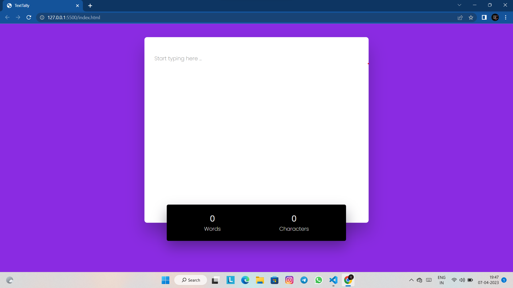

# Live Word and Character Counter

## Description

This is a simple web application that allows users to input text and see a live count of the number of words and characters in the text. The application is built using JavaScript and is completely responsive on different screen sizes.

## Technologies Used

* HTML
* CSS
* JavaScript

## Installation

1. Clone the repository <a href="https://github.com/Thirumalaikumar-M/word-character-counter.git">https://github.com/Thirumalaikumar-M/word-character-counter.git</a>
2. Open `index.html` in your preferred web browser

## Project files

* `index.html`: The main HTML file that contains the input field and the live counter display.

* `style.css`: The CSS file that styles the application.

* `script.js`: The JavaScript file that contains the logic for counting the words and characters.

* `snapshots`: The snapshots folder contains the sample screenshot and screen record of the application.

## Usage

To use the application, 

* Simply open the index.html file in your web browser or else try the <a href="https://thirumalaikumar-m.github.io/word-character-counter/">Github hosted page</a>

* Start typing in the input field

* You can see the live count of words and characters

* Instead of typing text you can also paste text from anywhere

## Screenshot

## Contributions

If you'd like to contribute to the project, feel free to submit a pull request. You can also report any bugs or issues using the GitHub issue tracker.

## License

This application is released under the  Feel free to use, modify and distribute
